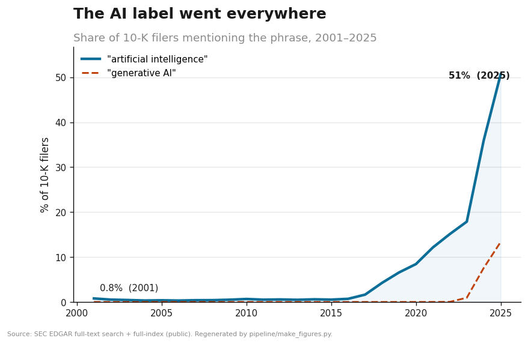
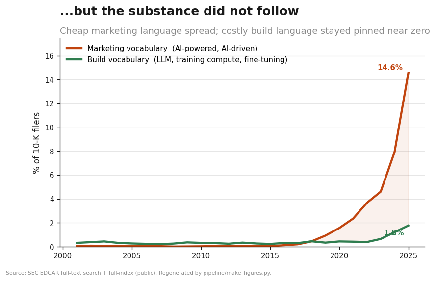
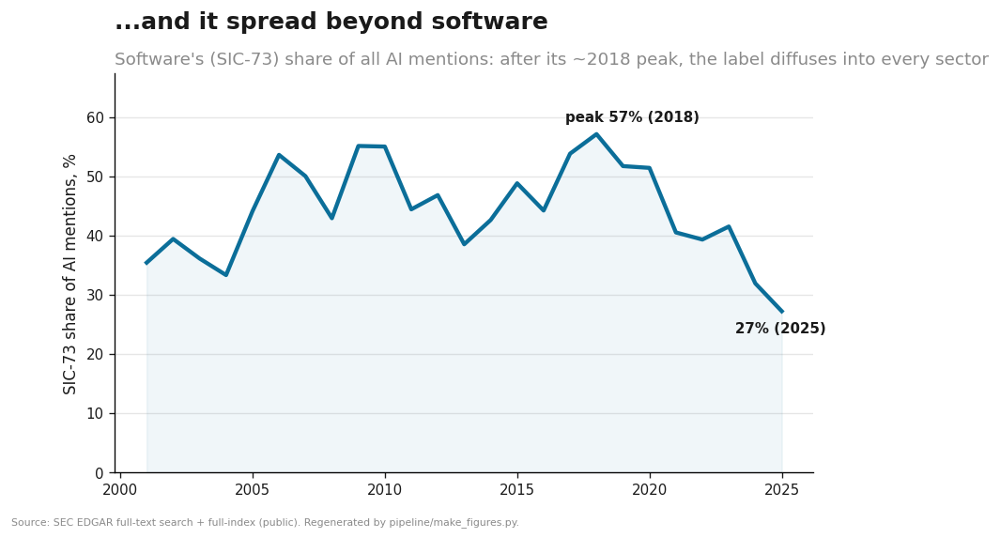
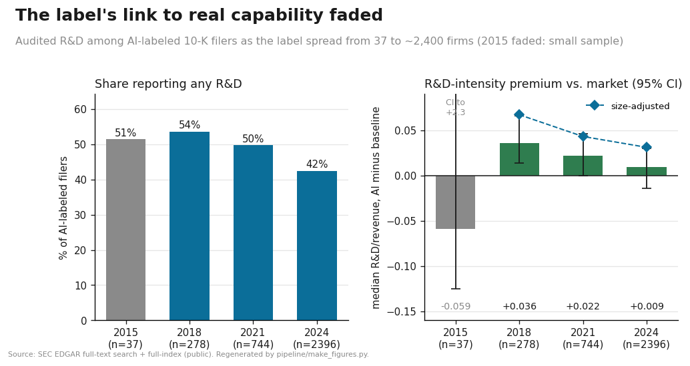
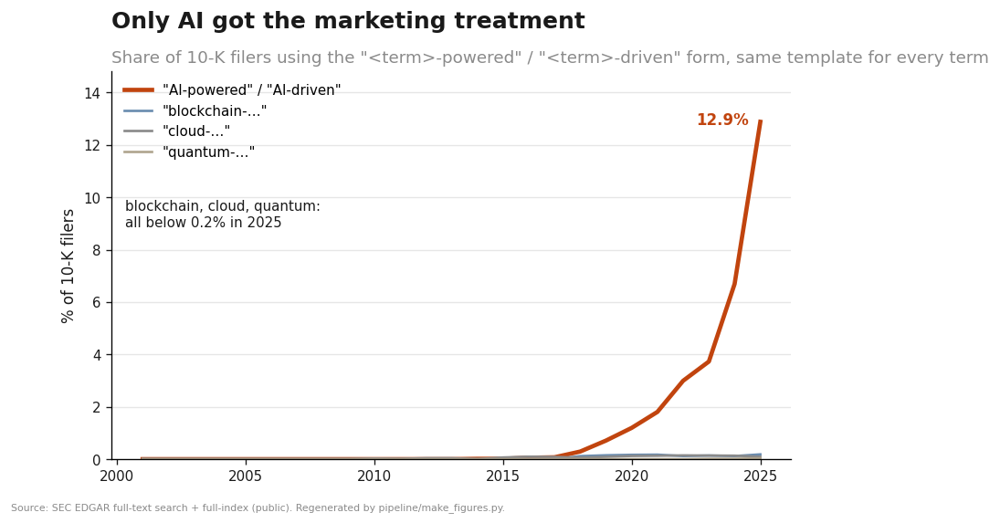
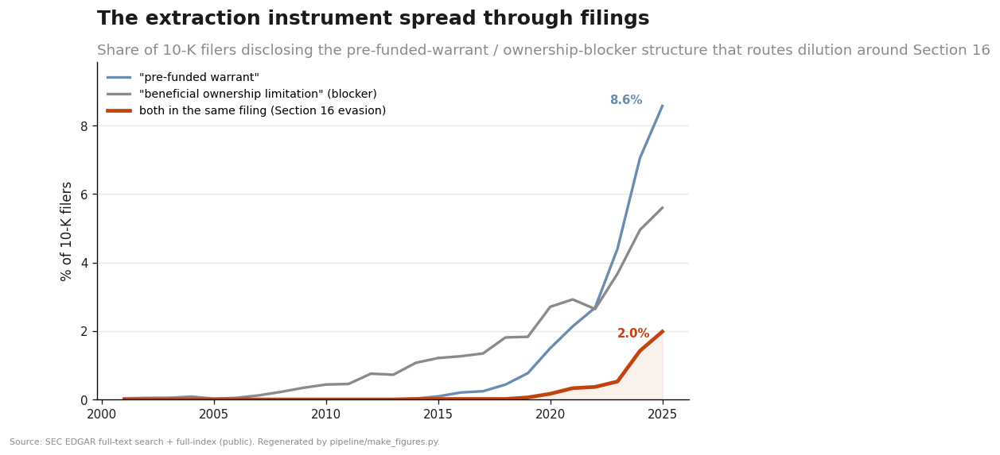
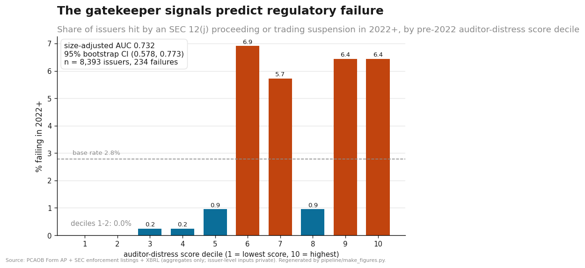

# Results: figure → script → number

The three README figures are the market-wide backbone of the project: the "AI"
label **went everywhere, stayed hollow, and left its home sector.** Every number
here is aggregate (one row per year, or per year × sector), no individual
issuer. All are regenerated from committed data under `data/aggregates/` by
[`pipeline/make_figures.py`](../pipeline/make_figures.py) (no network, no SEC
calls). The data itself is produced by the pure-standard-library scripts named
below, straight from public EDGAR endpoints.

For construction detail (denominators, phrase selection, identification), see
[`METHODOLOGY.md`](METHODOLOGY.md).

---

## F1: The label went everywhere



- **Number:** "artificial intelligence" appeared in **0.79%** of 10-K filers in
  2001 and **50.69%** in 2025. "generative AI" went from **0%** (through 2022) to
  **13.37%** in 2025, the vocabulary itself churns.
- **Data script:** [`pipeline/ai_prevalence.py`](../pipeline/ai_prevalence.py) →
  `data/ai_prevalence.csv` (committed at `data/aggregates/ai_prevalence.csv`).
- **Numerator:** 10-Ks matching a quoted AI phrase per year (EDGAR full-text
  search). **Denominator:** distinct 10-K filers per year from the EDGAR master
  index, the complete filing-level population, not the FTS total (which caps at
  10,000). This denominator fix is the key correctness step.

## F2: ...but the substance did not follow



- **Number:** in 2025, cheap *marketing* vocabulary ("AI-powered", "AI-driven",
  "AI-native"...) reached **14.55%** of filers while costly *build* vocabulary
  (large language model, training compute, fine-tuning, RAG, mixture of
  experts...) stayed pinned at **1.77%**. In 2001 both were near zero (0.05% /
  0.32%). The widening marketing-minus-substance gap is the washing fingerprint
  at the population level.
- **Data script:** [`pipeline/ai_lexicon.py`](../pipeline/ai_lexicon.py) →
  `data/ai_buckets_by_year.csv` (committed at
  `data/aggregates/ai_buckets_by_year.csv`).
- **Note:** bucket values are the summed share of their member phrases (an upper
  bound, since a filing can use several), so the *levels* are generous but the
  *divergence* between marketing and substance is the robust object.
- **Caveat (ecological inference):** a population ratio cannot classify an
  individual filing. The per-filing version of this test is part of the private
  issuer-level pipeline (excluded per the [Scope](../README.md#scope-what-is-not-here) section).

## F3: ...and it spread beyond software



- **Number:** software's (SIC-73) share of all AI mentions **peaked near 57% in
  2018** and fell to **27% by 2025**. The series is genuinely noisy in the early
  2000s (few AI-mentioning filers → small denominators), so the honest reading is
  *peak-to-present decline*, not a smooth 25-year slide.
- **Data script:** [`pipeline/ai_sector.py`](../pipeline/ai_sector.py) →
  `data/ai_sector_by_year.csv` (committed at
  `data/aggregates/ai_sector_by_year.csv`), an EDGAR FTS `sic_filter`
  aggregation rolled up to 2-digit SIC.

## F4: The label's link to real capability faded (a disciplining null)



- **Number:** measuring capability with **audited R&D** (hard to fake), as the AI
  label spread from **37** 10-K filers (2015) to **~2,400** (2024): the share of
  AI-labeled filers reporting *any* R&D fell to **42.4%** (2024), and their median
  R&D-intensity premium over the market baseline fell from **+0.036** (2018) to
  **+0.022** (2021) to **+0.009** (2024), toward zero.
- **With 95% bootstrap CIs (2,000 resamples, error bars in the figure):** the 2018
  premium is **+0.036 [0.014, 0.066]**, which excludes zero; by 2024 it is
  **+0.009 [−0.014, 0.030]**, which includes zero. So the label carried a premium
  distinguishable from zero in 2018 and no longer does by 2024. 2021 is marginal
  (**+0.022 [−0.0, 0.046]**).
- **Size control (diamonds in the figure):** recomputing the premium within total-assets
  terciles (cut on the baseline) and averaging, so AI firms are compared only to non-AI
  firms of similar size, gives **+0.067** (2018), **+0.043** (2021), **+0.031** (2024). It
  is *higher* than the raw premium (large low-R&D firms were diluting the raw figure) and
  still declines, so composition does not explain the fall. These are noisier: 95% CIs
  **[−0.003, 0.130]** (2018), **[−0.015, 0.121]** (2021), **[−0.012, 0.158]** (2024) are
  wide and mostly include zero, so the size-adjusted decline is directionally supportive but
  not sharply identified. 2015 has too few AI firms with reported assets to stratify.
- **Honesty flag:** the **2015** benchmark is only 37 firms (premium −0.059) and its
  CI runs to **+2.3** (a few tiny-revenue firms with huge R&D ratios), so it is
  uninformative and drawn faded. The defensible reading is the 2018-to-2024 erosion.
- **Why it's a null, not a hot take:** the claim is not "AI is hype"; it is that
  the label's *information content about real capability decayed* as it
  proliferated (a lemons precondition). This is one of several disciplining nulls
  the project keeps prominently (the return premium is large-cap only; enforcement
  does not re-separate the cross-section; the "hollow = washer" gap is mostly a
  size effect, see the README claim-map).
- **Data script:** [`pipeline/informativeness.py`](../pipeline/informativeness.py)
  → `data/informativeness.csv` (committed at
  `data/aggregates/informativeness.csv`). Self-contained: it builds the AI-labeled
  set per year from EDGAR full-text search and reads audited R&D / revenue from the
  XBRL `frames` cross-section, no pre-built universe file, no API key.
- **Note on the other nulls:** the market-data nulls (size/sector return premium,
  FF5+momentum alpha, the size-controlled classifier) depend on issuer-level
  universe and price data that is deliberately **not** in this public repo, so they
  are documented in the claim-map but not reproduced here.

## F5: Is the decoupling specific to AI? (placebo)



- **Number:** applying the same marketing template ("<term>-powered" / "<term>-driven")
  to AI and to control buzzwords, in 2025 the AI form reached **12.9%** of 10-K filers
  versus **0.18%** (blockchain), **0.09%** (cloud), and **0.03%** (quantum). AI's
  marketing form is roughly **70x** the nearest control, while bare mentions differ only
  about 3x (AI 50.7%, cloud 15.2%, blockchain 7.2%, quantum 2.7%).
- **Why it matters:** it answers the obvious objection that "every buzzword inflates."
  Using an identical construction for every term, only AI produced a large marketing
  vocabulary. The near-absence of "-powered" language for the controls is the finding.
- **Data script:** [`pipeline/placebo_terms.py`](../pipeline/placebo_terms.py) →
  `data/placebo_terms.csv` (committed at `data/aggregates/placebo_terms.csv`). Reuses the
  committed 10-K denominator; pure EDGAR full-text search.

## F6: The extraction instrument spread through filings



- **Number:** the pre-funded-warrant dilution instrument went from near zero before 2016 to
  **8.6%** of 10-K filers in 2025; the ownership blocker ("beneficial ownership limitation",
  which keeps a holder below the Section 16 / 5% threshold) reached **5.6%**; and the
  **paired structure** (both in the same filing, which routes dilution around Section 16
  insider disclosure) went from ~0 to **2.0%**, almost all of it since 2020.
- **Why it matters:** this is the detection layer pointed at the fraud *mechanism*, not the
  AI wrapper. It shows the capital-extraction toolkit spreading through public filings, and
  it is measurable market-wide from public data.
- **Honest boundary:** all three phrases have legitimate uses, so their prevalence is a
  **screening input, not a finding of fraud**. The fraud-relevant object is the co-occurrence
  of many red-flags at one small-cap issuer, which is issuer-level and out of scope for this
  public repo. See [`docs/SCREEN.md`](SCREEN.md) for the full method and validation design.
- **Data source:** the engine, [`python -m screen.run`](../screen/) (the `sec16_evasion`
  surface) → `data/aggregates/screen_registry.csv`. Reuses the committed 10-K denominator;
  pure EDGAR full-text search (space-separated quoted phrases are AND-ed, which gives the
  co-occurrence count). This figure is the single-source engine output; see
  [`docs/SCREEN.md`](SCREEN.md).

## The auditor market: how far issuer audits have moved off the Big-4

- **Number:** across every operating-issuer audit in PCAOB Form AP, the non-Big-4 share rose
  from **45.9%** (2016) to a **52.8%** peak (2021) and now sits near **49%** (2025). Of that
  non-Big-4 tail, the ten busiest small firms concentrate **35-49%** of the audits, so a small
  set of firms audits a large slice of the off-Big-4 market. Denominator: ~6,000-8,600
  operating-issuer audits per year (Investment Company and Employee Benefit Plan filings
  excluded).
- **Why it matters:** the gatekeeper is where small-cap fraud is caught or missed. A market in
  which roughly half of issuer audits sit outside the Big-4, and a concentrated group of small
  firms backstops much of that half, is exactly the auditor-market structure fraud research
  cares about. This is a second regulatory source (PCAOB, not EDGAR full-text), which is the
  point: the engine measures the breadth of the regulatory surface, not one API.
- **Honest boundary:** a small auditor is not fraud; most non-Big-4 firms audit clean small
  companies. The prevalence is a **market-structure input**, not an issuer verdict. The
  fraud-relevant object (a specific issuer with a distressed backstop auditor plus other
  red-flags) is issuer-level and stays out of this public repo.
- **Data source:** the engine, [`python -m screen.run`](../screen/) (the `auditor_market`
  surface, PCAOB Form AP under Sarbanes-Oxley Section 102) → `data/aggregates/screen_registry.csv`.

## Auditor churn and the backstop firms

- **Number:** year over year, the share of continuing issuers that switch audit firms rose from
  **8.4%** (2017) to **~12%** (2023-2025). The fraud-relevant direction, dismissing a Big-4 for
  a non-Big-4 firm, runs a steady **1.1-2.2%** of Big-4 clients per year. And of the issuers
  that switch to a non-Big-4 firm, **35-53%** land at just the ten busiest incoming small firms:
  a small set of firms absorbs much of the churn, which is the "backstop auditor" pattern as an
  aggregate.
- **Why it matters:** an auditor downgrade and a concentrated backstop are two of the clearest
  gatekeeper-distress markers in the small-cap fraud literature. Measuring them market-wide, from
  the same Form AP source, shows the phenomenon exists at scale before any single issuer is named.
- **Honest boundary:** switching or downgrading an auditor is common and usually benign (cost,
  a merger, a clean disagreement). These are **market-structure rates**, not issuer verdicts. The
  identity comparison collapses Big-4 network name variants so they do not read as false switches;
  small-firm identity is by normalized name, which is transparent but imperfect across firm
  mergers. Which specific issuers cycle through which backstop firms is issuer-level and private.
- **Data source:** the engine, [`python -m screen.run`](../screen/) (the `auditor_churn` surface,
  PCAOB Form AP) → `data/aggregates/screen_registry.csv`.

## F7: The gatekeeper signals predict regulatory failure



- **Number:** a transparent auditor-distress score (a 0-3 count of red flags from PCAOB Form
  AP: non-Big-4 auditor, a Big-4 to non-Big-4 downgrade, auditor churn), measured strictly
  through fiscal 2021, predicts which issuers are hit by an SEC Section 12(j) delinquent-filer
  proceeding or trading suspension in 2022 or later: **size-adjusted AUC 0.732, 95% bootstrap
  CI (0.578, 0.773)**, n = 8,393 issuers, 234 failures (base rate 2.8%). The top score deciles
  fail at **~6-7%** against **0.0%** in the bottom two deciles.
- **Why it matters:** this is the engine's claim made falsifiable, and it survived. The design
  is forward-looking (nothing after fiscal 2021 enters the score or the size control), the AUC
  is computed within size terciles, and size alone is *anti*-predictive here (AUC 0.11), so the
  result is not "small firms fail more" restated.
- **The null that makes it credible:** the same score was first run against SEC accounting
  enforcement releases (AAERs, 2016+) and came back **null**: size-adjusted AUC 0.564, CI
  (0.467, 0.649), straddling chance. AAER targets skew large and Big-4-audited, the opposite
  population from the nano-cap distress this score encodes. A separate noisy label (all Form
  25-NSE delistings, which mix compliance failures with mergers and note redemptions) was
  predicted in advance to come back null and did: AUC 0.492. The harness reports nulls when
  the labels are wrong, which is what makes the positive result worth something.
- **Honest boundary:** one dimension is validated (gatekeeper distress), not the composite
  screen; the score is coarse (0-3 integers, so deciles tie unevenly and the bar heights are
  lumpy); the CI is wide though clean of 0.5; and 12(j) resolution is name-based on the
  issuers that once filed 10-Ks, which aligns with the scored universe but is imperfect.
- **Data source:** the committed aggregates `validation_summary.csv` and `validation_lift.csv`.
  These are exported from the private issuer-level run (PCAOB Form AP histories, XBRL assets,
  SEC enforcement listings resolved to CIK); only the aggregate statistics cross into this
  repo, per the [methodology](METHODOLOGY.md) wall.
- **Reproducibility, stated exactly:** F7 is **verifiable in method but not re-runnable from this
  public repo.** The scoring *method* (a transparent 0–3 flag count) and the *statistical harness*
  that produces the AUC, CI, and decile lift — [`screen/validation.py`](../screen/validation.py) —
  are both public and unit-tested against analytic answers (`tests/test_validation.py`: AUC = 1.0 /
  0.0 / 0.5, planted-signal recovery, noise → 0.5, determinism). What is *not* public is the
  issuer-level input table (each firm's score, size, and 2022+ outcome), because it is issuer-level
  by construction. A reader can therefore audit *how* the number is computed and re-run the harness
  on any labeled table, but cannot regenerate this specific AUC from this repo alone — an inherent
  consequence of the aggregate-only wall, not an omission.

---

## Reproduce

```bash
pip install matplotlib
python pipeline/make_figures.py        # reads data/aggregates/, writes docs/figures/
```

To regenerate the underlying aggregates from live EDGAR (slower; needs a real
User-Agent, see the README):

```bash
python pipeline/ai_prevalence.py       # F1 data
python pipeline/ai_lexicon.py          # F2 data (reuses ai_prevalence's denominator cache)
python pipeline/ai_sector.py           # F3 data
python pipeline/informativeness.py     # F4 data (heavier: pages the AI-filer set + XBRL R&D)
python pipeline/placebo_terms.py       # F5 data (AI vs control buzzwords)
python -m screen.run                   # F6 data (the engine: sec16_evasion + all surfaces)
```

Absolute counts drift as new filings arrive on EDGAR; the **shapes and ratios**
are the stable objects.
