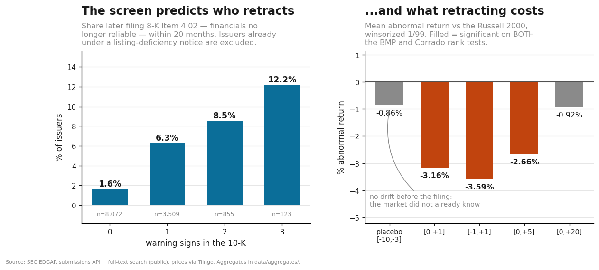

# Predicting disclosure failure, and pricing it

Everything else in this repo measures how a *label* behaved. This page measures something harder and
more useful: whether standard warning signs in a small company's annual report predict that the
company will later be **forced by rule to correct the record** — and what the market pays when it
does.

Two things make this test worth more than the return-based validation in [RESULTS.md](RESULTS.md):

- **The outcome is not a price.** It is a mandatory SEC filing. A company is not accused of anything
  by anyone; it files an 8-K Item 4.02 stating that its own previously issued financial statements
  **should no longer be relied upon.** The date is set by the issuer's legal obligation, so it cannot
  be chosen with hindsight, and the classification is EDGAR's, not ours.
- **The screen was never fitted to it.** The warning signs were selected and validated against
  forward returns. Restatement is an out-of-sample outcome of a different kind.



---

## The population

14,282 issuer-vintages: every 10-K filer for 2022, 2023 and 2024, sized from XBRL total assets, with
funds, BDCs, SPACs and crypto ETPs excluded by form type and SIC. Warning signs come from six phrase
surfaces in the 10-K plus two structural detectors, grouped as in [SCREEN.md](SCREEN.md).

18,972 dated revelation events were assembled for 4,224 of those issuers from the EDGAR submissions
API — non-reliance (Item 4.02), listing deficiency (Item 3.01), auditor change (Item 4.01), and late
filing (NT 10-K/10-Q). Every event postdates the 10-K it is scored against.

---

## Result 1 — the screen predicts who retracts

`data/aggregates/revelation_incidence.csv` · `revelation_discrimination.csv`

Among issuers with **no prior listing-deficiency notice**, share later filing a non-reliance 8-K
within 20 months:

| warning signs | n | retracted own financials |
|---|---|---|
| 0 | 8,072 | 1.6% |
| 1 | 3,509 | 6.3% |
| 2 | 855 | 8.5% |
| 3 | 123 | **12.2%** |

Size-adjusted AUC **0.606** (0.575–0.639). Monotone. **7.5× top to bottom.**

### How much of this is size?

Some of it. Reported here rather than argued away, because it is the first objection anyone should
raise.

The flagged firms are small — median total assets **$17.9M** at two warning signs against **$2.1B** at
zero — and small firms fail more. So part of the raw gradient is size:

| | non-reliance | listing deficiency | any revelation |
|---|---|---|---|
| raw AUC | 0.689 | 0.711 | 0.741 |
| **size-adjusted (within terciles)** | **0.605** | **0.606** | **0.621** |
| share of the raw edge that is size | 44% | 50% | 50% |

**The 0.605–0.621 is what survives, and it is the figure quoted everywhere in this repo.** Its CI is
clear of 0.5, so the screen is not only size — but it is not size-free either, and a claim that it
were would be wrong.

**A note on `auc_size_only`, which is easy to misread.** It reads 0.185–0.305 here. That does *not*
mean size is uninformative. AUC is P(a failure scores higher than a survivor), so a value far *below*
0.5 means small firms fail **much** more — size is highly informative, just in the protective
direction. All "anti-predictive" legitimately means is that using size directly as a risk score
(bigger = riskier) would perform worse than chance. It is the size-**stratified** AUC, not the sign
of the size coefficient, that separates a screen from a size proxy. Elsewhere in this repo that
distinction cuts the other way and favourably: F7's raw AUC is 0.735 against 0.732 size-adjusted, so
size explains almost none of *that* result.

### What did not survive, and why it is shown

The raw version of this result was much larger and is **withdrawn**. Listing-deficiency incidence ran
8.1% → 71.0% across warning-sign counts. Two attacks were run:

| attack | why | effect |
|---|---|---|
| **Size** | Nasdaq's continued-listing rules include a $1 minimum bid price, so a stock at $0.80 gets a notice almost mechanically | **Survives, but size does real work.** ~50% of the raw edge is size (0.711 → 0.606 within terciles); the size-controlled figure still clears chance decisively |
| **Circularity** | One surface fires on "reverse stock split" — and firms reverse-split *in order to cure* a bid-price deficiency, so it may detect a notice already received | **Partly lands.** AUC 0.606 → 0.579 dropping that surface, → 0.572 dropping the whole pillar |
| **Repeat notices** | An issuer already under a notice can receive another | **Lands hardest.** → 0.567, and combined with the surface drop → **0.550** |

Stressed, the listing-deficiency gradient flattens from 8.1%→71% to roughly **10%→27%**, and
monotonicity breaks in two of three vintages. **The 71% figure should not be quoted.**

Non-reliance is the outcome with no circular route — a reverse stock split cannot cause a restatement
— and it gets *stronger* under the restriction (7.5× vs 3.9× unrestricted), because removing issuers
already in distress removes a confounded group. That is why it is the headline and listing deficiency
is not.

### One detector is much sharper than the screen

`data/aggregates/tier_a_precision.csv`

Evaluated as a **trigger** rather than a ranking model, against non-reliance (base rate 4.13%):

| detector | firms flagged in 3 years | precision | **lift** | Fisher exact p |
|---|---|---|---|---|
| **manufactured asset** | 29 | **17.2%** | **4.17×** | 0.006 |
| share explosion | 539 | 9.1% | 2.20× | <0.0001 |
| period inconsistency | 4 | 0.0% | — | 1.00 |

Twenty-nine companies in three years, and one in six later retracts its financials.

**AUC cannot see this, and that is a property of AUC.** For a binary flag, AUC is
(sensitivity + specificity)/2, so a flag firing on 0.2% of the population is pinned near 0.5 whatever
its precision — the manufactured-asset detector scores 0.501. `screen/eventstudy.auc_ceiling` computes
the bound explicitly. Use precision and lift for triggers; keep AUC for ranking models.

The third detector is a **failure** and is reported at the same length as the two that work: four
firms, zero restatements. It was built from a single confirmed case and does not generalise.

---

## Result 2 — which signals carry independent information

`data/aggregates/model_coefficients.csv` · `model_marginal_effects.csv` · `model_fit.csv` ·
`model_calibration.csv`

Counting warning signs assumes every signal deserves equal weight and that size can only be handled
by binning. A logistic model drops both: each surface enters separately, size enters continuously,
and every coefficient carries a standard error. **Errors are clustered by issuer** — 14,282
issuer-vintages but only 6,192 distinct issuers, most appearing two or three times, so unclustered
errors would badly overstate precision. Year and industry fixed effects throughout.

Odds ratios, the same specification against three outcomes (sixteen candidate signals, including
the seven registry surfaces added below):

| signal | non-reliance | any revelation | price collapse |
|---|---|---|---|
| **Going-concern doubt** | **1.72**\*\*\* | **2.10**\*\*\* | **1.74**\*\*\* |
| **Material weakness** ("identified a…") | **1.95**\*\*\* | **1.90**\*\*\* | **1.36**\*\* |
| Material weakness (other phrasing) | **1.41**\* | **1.24**\*\* | 1.14 |
| A1 share explosion | 1.27 | **1.92**\*\*\* | **1.73**\*\*\* |
| Reverse stock split | 1.08 | **1.40**\*\*\* | **1.38**\*\*\* |
| At-the-market facility | 0.93 | **1.25**\* | **1.27**\*\* |
| Standby equity purchase | 1.73 | 2.21 | 1.03 |
| Equity line of credit | 1.44 | 1.28 | 1.13 |
| Subpoena received | 1.14 | 1.33 | 1.35 |
| A3 manufactured asset | 1.44 | 3.34 | *non-est.* |
| Pre-funded warrant + blocker | 0.93 | 0.78 | 0.99 |
| Pre-funded warrant (unpaired) | 0.94 | 0.90 | 1.23 |
| P8 ramp signature | 0.93 | 0.99 | 0.77 |
| Wells notice | *non-est.* | 0.85 | 0.97 |
| Variable-rate convertible | *non-est.* | *non-est.* | *non-est.* |
| A4 period inconsistency | *non-est.* | *non-est.* | *non-est.* |
| **log(public float)** | **0.89**\*\*\* | **0.84**\*\*\* | **0.94**\*\* |
| log(total assets) | 1.01 | **0.87**\*\*\* | **0.85**\*\*\* |
| free-float ratio | 1.04 | **1.04**\*\* | **1.04**\* |
| Shell company | **1.75**\*\* | **3.07**\*\*\* | **1.91**\*\*\* |
| Prior revelation (pre-10-K) | **1.95**\*\*\* | **2.38**\*\*\* | **1.22**\*\* |
| Curing a listing deficiency *(control)* | 0.96 | **2.33**\*\*\* | **1.29**\* |

*\*\*\* p<.001, \*\* p<.01, \* p<.05. Joint tests on the signal block: chi2(13)=103.0 p=4e-16;
chi2(14)=357.6 p=1e-67; chi2(13)=161.2 p=1e-27.*

**Only the auditor-admission signals predict every outcome** — going-concern doubt and material
weakness. Both are things the auditor or management already wrote down and filed.

**The dilution markers predict distress, not misstatement.** Share explosion, reverse split and the
at-the-market facility are strong for *any revelation* and *price collapse* and flat for
*non-reliance* — the right pattern, since a reverse split responds to a listing problem rather than
symptomising bad accounting. A third independent confirmation of the circularity finding above.

**The relevant size dimension is float, not assets.** log(public float) is significant against all
three; log(total assets) is not significant at all for non-reliance (OR 1.01).

**A3 is underpowered, not refuted.** Its interval is [0.54, 3.83] on 29 firms and 5 events — wide
enough to admit a near-doubling and to admit nothing. Against *any revelation* it cannot be estimated
out of sample at all: in the training window it fires on 21 issuers and **all 21** had a revelation.
Perfect separation, reported rather than absorbed.

**Out of sample** (fit on 2022+2023, scored on 2024):

| outcome | model AUC | count-score AUC |
|---|---|---|
| non-reliance | **0.764** | 0.728 |
| any revelation | **0.855** | 0.751 |
| price collapse | **0.777** | 0.714 |

These are **not** comparable to the 0.606 above, which strips size out entirely; these include it as
a predictor.

### The headline as a difference, not a ratio

`data/aggregates/headline_difference_in_proportions.csv`

"12.2% versus 1.6%" is a **difference in proportions**, and quoting it only as a ratio (7.5×) hides
the base rate and has no natural interval. Stated properly:

| warning signs | rate | difference vs 0 signs | 95% CI |
|---|---|---|---|
| 1 | 6.3% | **+4.7pp** | [+3.8, +5.5] |
| 2 | 8.5% | **+6.9pp** | [+5.0, +8.8] |
| 3 | 12.2% | **+10.6pp** | [+4.8, +16.4] |

All three exclude zero. *Caveat:* the textbook interval assumes two independent samples, and these
are strata of one population with issuers recurring across vintages, so these are too narrow. The
cluster-robust marginal effects in Result 2 are the ones to prefer — they are the same quantity,
computed correctly.

### Adding signals: what earned its place and what did not

The registry specifies twenty-three surfaces; the pillar set used six. Seven more full-text surfaces
were fetched and entered, each on its own coefficient. Adding candidates is not finding signal — a
surface that does not earn its place says so:

| new surface | verdict |
|---|---|
| **"identified a material weakness"** | **Earns it.** 1.95\*\*\* / 1.90\*\*\* / 1.36\*\* — *stronger on every outcome than the phrasing originally used* |
| "at-the-market offering" | Partial. n.s. for restatement, 1.25\* / 1.27\*\* for the broader outcomes — the dilution-marker pattern again |
| "Wells notice" | **Null, and strikingly so.** 43 issuer-vintages disclosed one; **zero** subsequently filed a non-reliance 8-K. Non-estimable for restatement, null elsewhere |
| "received a subpoena" | Null on all three |
| "pre-funded warrant" (unpaired) | Null on all three |
| "variable rate convertible" | Non-estimable — fires on 4–6 issuer-vintages |
| "regain compliance" | Kept as a **control**, not a signal: it measures "already curing a listing deficiency" directly, which is the confounder that inflated the raw result. 2.33\*\*\* on any-revelation |

**The phrase-sensitivity finding is the important one.** The original pillar used
`"material weakness in our internal control"`; the registry's is `"identified a material weakness"`.
Both capture material-weakness disclosure, they select overlapping but different issuers, and the
registry phrasing is the stronger predictor everywhere. With both in the model the original drops
from OR 2.00 to 1.41. **Part of the earlier result was an artefact of which string was chosen** — a
measurement-error problem, not a modelling one, and invisible until two phrasings were run
side by side.

Net effect on out-of-sample discrimination: non-reliance **0.753 → 0.764**, any revelation 0.852 →
0.855, price collapse 0.776 → 0.777. Real but small, and concentrated in the outcome that matters.

**The Wells-notice null deserves a sentence of its own.** An SEC Wells notice is the staff's advance
warning that enforcement is recommended — about the strongest public signal that a regulator has
already found something. Across three years, 43 issuer-vintages disclosed receiving one and none went
on to file a non-reliance 8-K. The plausible reading is that Wells notices in this population concern
disclosure and trading conduct rather than accounting, and that a firm already in an enforcement
process has typically resolved its financial-statement question before that point. It is reported
because a signal that *should* work and does not is worth as much as one that does.

### Calibration: fixed, and it matters for the policy claim

`data/aggregates/model_calibration_fix.csv`

The uncorrected model over-warns. Platt scaling — a monotone rescaling that cannot change the ranking
— was fitted on a **three-way temporal split**: train on 2022, learn the calibration map on 2023
which the model never saw, apply to 2024 which neither saw.

| outcome | ECE before | ECE after | top decile predicted → actual |
|---|---|---|---|
| non-reliance | 2.41pp | **1.50pp** | 21.0% → 16.9% (actual 11.4%) |
| any revelation | 8.52pp | **3.95pp** | 98.0% → 95.8% (actual 90.9%) |
| price collapse | 5.29pp | **3.78pp** | 84.6% → 74.0% (actual 58.9%) |

AUC is unchanged in all three, by construction. Expected calibration error falls by roughly a third
to a half. It still over-warns, so the honest framing remains "an ordering with roughly-right levels"
rather than a calibrated risk — but the gap between the two has closed materially.


### Watch the coefficient move: nested specifications

`data/aggregates/model_nested_specs.csv` · `model_nested_fit.csv`

A single specification hides what matters. **The movement of a coefficient as controls enter is
itself the evidence about confounding.** Linear-probability scale, so cells read as percentage points
against a 4.13% base rate; cluster-robust SE beneath.

| | (1) bivariate | (2) + signals | (3) + size | (4) + structure | (5) + FE |
|---|---|---|---|---|---|
| **Going-concern doubt** | **6.88**\*\*\* | 5.89\*\*\* | 4.83\*\*\* | 2.98\*\*\* | **3.05**\*\*\* |
| | (0.60) | (0.63) | (0.74) | (0.74) | (0.74) |
| **Material weakness** | — | **5.53**\*\*\* | 5.45\*\*\* | 4.53\*\*\* | **4.52**\*\*\* |
| | | (1.02) | (1.03) | (1.03) | (1.04) |
| A1 share explosion | — | 1.95 | 1.63 | 1.76 | 1.87 |
| Reverse stock split | — | 0.46 | −0.07 | 0.30 | 0.34 |
| Observations | 14,282 | 14,282 | 14,282 | 14,282 | 14,282 |
| R² | 0.022 | 0.034 | 0.036 | 0.043 | 0.046 |

**Going-concern doubt loses more than half its association to controls** (6.88pp → 3.05pp).
**Material weakness barely moves** (5.53 → 4.52). They are not equally confounded, and only the
nested view shows it. The logit agrees (going-concern 4.10 → 1.72; material weakness 2.25 → 1.99) —
and that the linear probability model and the logit agree is itself the robustness check.

### Omitted variables, signed

`data/aggregates/omitted_variable_bias.csv`

The controls are what EDGAR contains; the variables that would matter most are unobservable. They
cannot be estimated, but the bias can be **signed**: bias = γ (omitted → outcome) × δ (omitted →
included regressor). A bias sharing the true effect's sign means the estimate is overstated.

| omitted variable | affects | γ | δ | bias | verdict |
|---|---|---|---|---|---|
| Severity of underlying distress | going-concern | + | + | **+** | **overstated** |
| Audit quality / diligence | material weakness | + | + | **+** | **overstated** |
| Willingness to admit error | all signals | + | 0/+ | + | overstated |
| Litigation / D&O pressure | going-concern | + | + | **+** | **overstated** |
| Firm age since IPO | shell flag | + | − | **−** | *understated* |

Signs are reasoned, not estimated — the method when the variable is unavailable. **Four of five push
the same way.** The second row is the sharpest form of the reporting-bias caveat below: a diligent
auditor both finds material weaknesses and forces corrections, so the model may partly measure who
has a thorough auditor rather than who has a problem.

### The signals work better on LARGER issuers

`data/aggregates/model_interactions.csv`

Every coefficient assumes a signal means the same thing for a $17M shell and a $2B issuer. Testing
that by interacting each signal with size:

| signal | main effect | × size | p | reading |
|---|---|---|---|---|
| Going-concern doubt | 2.16 | **1.63** | 0.0001 | **strengthens as size rises** |
| Material weakness | 2.40 | **1.56** | 0.0003 | **strengthens as size rises** |
| A1 share explosion | 1.08 | 0.87 | 0.43 | no size dependence |
| Reverse stock split | 1.34 | 1.27 | 0.06 | no size dependence |

**This inverts the intuition the project was built on.** The screen was expected to earn its keep at
the small end where nobody is watching; the opposite holds for the signals that predict restatement.
The mechanism is base rates — among nano-caps a going-concern paragraph is close to ambient and
separates little, while for a company with a real balance sheet it is rare and sharply abnormal.
**The marginal value of this screen is highest where examination attention is already concentrated,
and lowest in the nano-cap tail.** The dilution markers show no gradient and remain the small-end
instruments, but they are the ones that do not predict restatement.

---

## Result 3 — what retracting costs

`data/aggregates/car_by_event_type.csv` · `attributable_loss.csv`

Abnormal returns around each filing, benchmarked to the Russell 2000, with each firm's market model
estimated over the prior year. Three test statistics; a result counts only where the two robust ones
agree.

**Non-reliance, two-day window:**

| | |
|---|---|
| mean abnormal return | **−3.16%** |
| median | −0.72% |
| share negative | 65% |
| BMP / Corrado | **−4.39 / −5.38** |
| **placebo window [−10,−3]** | −0.86%, Corrado −0.60 — **null** |

The placebo is the argument. There is no drift before the filing, so this is information the market
did not already have. Restricting to the 174 issuers with no other revelation filing nearby, it holds
at −2.03% with the placebo dead flat.

**Aggregate attributable loss** — first revelation per issuer, so a company filing several notices is
not counted several times; public float rather than market cap, because insider-held shares are not
public losses:

| | |
|---|---|
| issuers | 2,115 |
| public float | $636.6B |
| float-weighted abnormal return | −1.65% |
| **attributable loss** | **−$10.47B** (95% CI −$15.29B, −$5.89B) |

**Auditor changes move nothing.** Item 4.01 is null on every window and every test — a useful null,
since an auditor resignation reads like bad news and is not priced as news.

### Why three tests

Nano-cap returns break the standard toolkit. In the first uncorrected run, mean CARs came back at
**−172% and +2,299%** while the medians sat near −1%: a stock going $0.01 → $0.60 enters a CAR as
+59.0 and decides the average by itself.

| test | what it survives |
|---|---|
| cross-sectional *t* | nothing in particular — reported for comparability, not relied on |
| **BMP** (1991) | event-induced variance, which a revelation causes mechanically and which the plain *t* reads as significance |
| **Corrado** (1989) rank | magnitude entirely — uses only ordering, so one extreme name cannot carry a result |

Plus 1/99 winsorization before any mean is taken. The estimators are in
[`screen/eventstudy.py`](../screen/eventstudy.py) and validated against synthetic data with planted
answers in [`tests/test_eventstudy.py`](../tests/test_eventstudy.py) — including that the rank test
ignores a planted +600% outlier that drags mean CAR to +3.3%, and that BMP does not fire under 6×
event-day variance with no mean effect.

---

## Where the error actually comes from

A confidence interval describes **sampling error** — the fluctuation you would see across repeated
draws. It says nothing about **non-sampling error**: bias from who is missing, from how the outcome
is recorded, or from what the frame excludes. That distinction matters more here than the intervals
themselves:

> **Every confidence interval on this page describes sampling error only. The dominant uncertainty
> in this analysis is non-sampling, and it appears in none of them.**

**What is even being inferred?** This is a census, not a sample — every 10-K filer for three years.
The frequencies are known exactly. Standard errors are meaningful only under the reading that the
observed years are one realisation of an ongoing data-generating process, and that the object of
interest is the propensity that will govern issuers filing in 2026 and 2027. Under that reading the
effective number of independent draws is closer to **three** than to 14,282 — which is why
replication across three vintages carries more weight here than the width of any one interval.

**Non-response bias, measured rather than assumed.** The 2022 vintage parses at **57.8%** against
84–87% for 2023–24, because cover-page XBRL was phased in by filer status, so the loss is
size-correlated. Checking whether the non-responders differ on the outcome: issuers whose cover
failed to parse stop filing at **75.8%** over two years against **80.4%** for those that parsed.
They fail *more*, so the 2022 sample is marginally cleaner than the population and its base rate is
understated — the bias runs toward conservatism. Separately, only **52%** of revelation events are
priceable; already-delisted issuers cannot be priced, and those are the worst outcomes, so the
dollar figure **understates**.

**Reporting bias, and it is in the dependent variable.** This is the deepest limitation on the page.
A firm that *should* declare non-reliance and does not is recorded as a non-event. So the model does
not predict having an accounting problem — it predicts **admitting** to one. Any issuer that
conceals successfully enters the data as clean.

**Frame coverage.** 10-K filers only. Foreign private issuers file 20-F and are absent by
construction, as are non-reporting companies.

None of these three shrinks by collecting more rows. They are not sampling error.

## Other limits

- **Three windows, one macro era** (2022–2026). The screen has not seen a credit event.
- **Modest discrimination.** AUC ≈ 0.61. This sorts a haystack; it is not a metal detector.
- **Predicts correction, not fraud.** Restatement is a statement about *disclosure*. Intent is not
  observable here, and nothing in this repo identifies anyone as a wrongdoer.
- **The model over-warns by roughly 2×** in the top decile — usable as an ordering, not as a
  probability.
- **The dollar aggregate is not robust to dropping confounded events**; the percentage effect is.
- **Listing-deficiency and late-filing events are partly anticipated** (significant pre-event drift).
  Non-reliance is not. Only non-reliance reads as a clean surprise.

## What follows

See [POLICY.md](POLICY.md). In short: this belongs in an examination queue and nowhere else. At 9.1%
precision the share-explosion detector produces ten false positives per true one, so a published
issuer-level score would brand nine solvent companies for each troubled one — with financing
consequences for exactly the firms least able to absorb them. **The output is a queue, not a verdict.**

## Reproduce

```bash
python3 pipeline/make_figures.py && python3 -m pytest tests/test_eventstudy.py -q
```

The aggregates under `data/aggregates/` are committed. Building the revelation calendar and
estimating issuer-level CARs happens in a separate private repository, per the scope note in the
[README](../README.md#scope-what-is-not-here); only population-level rates and statistics cross into
this one.
